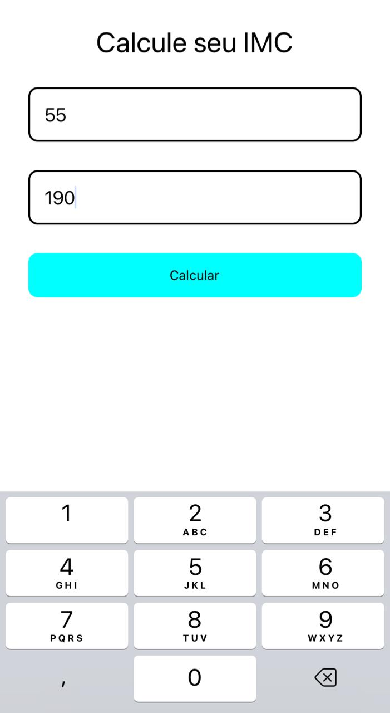
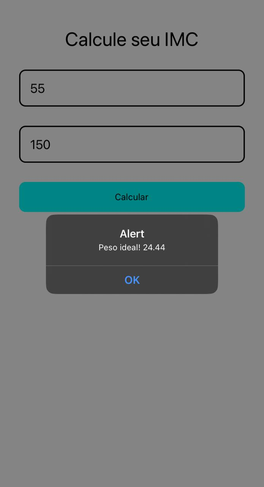

<!-- Título -->

<h1 align="center">IMC</h1>

<!-- Descrição -->

<p align="center">Desenvolvimento feito em React Native para medir IMC das pessoas.</p>

<!-- Súmario -->

<p align="center">
 <a href="#rodando-a-aplicação">Rodando A Aplicação</a> •
 <a href="#tecnologias">Tecnologias</a> •
 <a href="#autor">Autor</a>
</p>

<div align="center">
    
    •••
    
</div>

---

### Rodando A Aplicação

Clone o projeto com

```sh
git clone https://github.com/MatheusPalmieri/IMC
```

Entre na pasta do projeto e instale as dependências com:

```sh
# Instalando o Expo
npm i -g expo-cli


# Instalando as dependências
npm install
```

Execute o comando para inicializar a aplicação

```sh
expo start
```
ou

```sh
npm start
```

---

### Tecnologias

As seguintes ferramentas foram usadas na construção do projeto:

- [React Native](https://reactnative.dev/)
- [Expo](https://expo.dev/)
- [JavaScript](https://www.javascript.com/)

---

### Autor

Create for <b>`Matheus Palmieri`</b>👨‍💻

<br>
<br>

<p align="center">🎉Projeto IMC Finalizado🚀</p>

